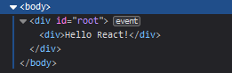
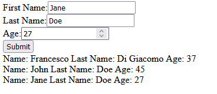
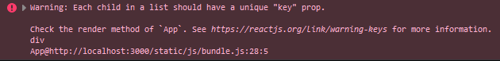
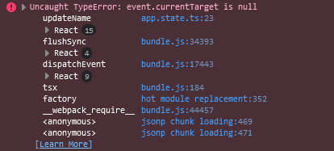

### [Back to List of Topics](Contents.md)

# Unit 1: Introduction to React
React is a functional front-end library for Javascript/Typescript used to build user interfaces based on UI components. It is used to build single-page applications. In this unit we focus about fundamental concepts about React and application state management. In this unit we create a simple front-end application with the React starter kit for Typescript without focusing on how to integrate it in a .NET application, which will be explained at a later stage.

## Hello world in React
In order to create our first react application we need to create a `index.tsx` file that acts as entry point of our application and where we instantiate a root for the React Document Object Model (or DOM). We can do so by calling the function `createRoot` from the `ReactDOM` module (which needs to be imported first).

```typescript
import ReactDOM from 'react-dom/client';

const root = ReactDOM.createRoot(
  document.getElementById('root') as HTMLElement
)
```

>Notice that, in order to be able to correctly parse files containing react elements, we need to use the extension `.tsx`. All the files containing "standard" typescript code can instead use the usual `.ts` extension.

This function returns an object of type `ReactDOM.Root` that can be used to render react UI elements. We can now create a second file `app.tsx` where we create our first react component. A simple react component can be created by implementing a function that returns a `JSX.Element`. For now, we will create a component that displays the message "Hello React!" on the screen.

```typescript
export const App = (): JSX.Element => (
  <div>
    Hello React!
  </div>
)
```
In order to render the component that we have just implemented, we need to go back to our `index.tsx` and call the `render` method available in the `React.Root` object that we had previously instantiated:

```typescript
root.render(
  <React.StrictMode>
    <App />
  </React.StrictMode>
)
```

>`React.StrictMode` is a built-in react tool that provides additional warning in development mode for components.

Notice how in the `render` method we are inlining some code that resembles the HTML document syntax/structure, and how our function that returns a `JSX.Element` can also be invoked with the same syntax. If we take a look at what the HTML document body contains, we see the following: 



We have a `div` with id `root` containing another `div` displaying the text "Hello React!". The first `div` comes from the `React.Root`, which was created by passing as input to the creation function the `root` element of the HTML document. The second `div` is instead generated by our custom function. The `root` element acts a static bit of the page that we give to react as an empty canvas where React renders the result of the `render` method invoked using the `root` object. React will, at 16 frames per second, produce some elements as result of its operation, take those elements and put them in the "canvas" to be rendered. Notce that React does not naively redraw everything, instead it is going to compute the difference of what is already drawn in the canvas and any new element that might be created as result of its operations and draw again only what has changed.

>It is very important to understand that what looks like an HTML element (like `div` used before) is instead an object in memory created by React and that our code looks very similar to HTML just because of syntactical sugar available in typescript. All the React elements are objects in memory that will be later converted to their HTML counterpart by React when running the `render` method.

Of course this is not yet very exciting, because we are not providing any means of user interaction, as we would expect from a UI. In the next section we will se how to implement a component in react which responds to user input.

## Stateless to stateful
In the previous section we explored the basic mechanism behind React rendering, and we defined our first react component. This component is static, in the sense that it does not change according to an external event. In this section we explore how to implement dynamic components, that is, components that change according to external "stimuli".

As an example, we are going to implement a simple registration form for a person. The form will be made of three input fields (name, last name, and age) and a button to submit the form. For now, we will not persist the data to a remote storage, rather we use memory to store the information sent by the form. The topic of handling asynchronous calls in React to send and receive data from an external source will be covered in another chapter.

In order to implement a component that responds to user interaction we use React components. A custom React component can be implemented by inheriting the class `React.Component`. A `React.Component` is a generic class (in the sense that it requires some type parameters to be instantiated) accepting two type parameters: one for the `props` and one for the `state`. In this section we are focusing mainly on the state, so for now we will not be using `props`, which are discussed further ahead. For now, we will pass an empty object for the props and state. We create a component with the 3 input fields and the button to submit the data.

```typescript
export class App extends React.Component<{}, {}> {
  constructor(props: {}) {
    super(props)
    this.state = {}
  }
}
```

The code snippet above defines the class for a react component where both `props` and `state` are empty object. The constructor for the class takes as input the `props`, pass them to the parent class `React.Component`, and instantiate the initial `state` for the application. The field `state` is also inherited from `React.Component`. In order to render the component, we must provide the implementation of the `render` method, which accepts no parameters and returns a `JSX.Element`:

```typescript
render(){
    return (
      <div>
        <div>
          First Name:
          <input
            value={""}
          />
        </div>
        <div>
          Last Name:
          <input
            value={""}
          />
        </div>
        <div>
          Age:
          <input
            value={18}
            type={"number"}
          />
        </div>
        <div>
          <button>
              Submit
          </button>
        </div>
      </div>
    )
  }
```

The input fields have a property called `value` to actually define the value/text displayed in the input box. The last input field uses the property `type` to restrict the input to numerical. If we run the program again, we correctly see three input fields and the button `Submit`, but if we try to interact with any of the elements, nothing happens. This is because the component, for now, is stateless, so it is not registering any changes following a user interaction. In order to make this possible, we need to define a state for our component. Our state will need to store the value of the three input fields, and react to a click in the button. We thus define an interface holding this information:

```typescript
interface AppState {
  name: string
  lastName: string
  age: number
}
```

We also change the definition of our component to actually use `AppState` as type parameter for the state and to initialize the state with a record of that type:

```typescript
export class App extends React.Component<{}, AppState> {
  constructor(props: {}) {
    super(props)
    this.state = {
      name: "",
      lastName: "",
      age: 18
    }
  }

  render() {
    ...
  }
}

```

We now have to use the state to display the values in the input boxes:

```typescript
render(){
    return (
      <div>
        <div>
          First Name:
          <input
            value={this.state.name}
          />
        </div>
        <div>
          Last Name:
          <input
            value={this.state.lastName}
          />
        </div>
        <div>
          Age:
          <input
            value={this.state.age}
            type={"number"}
          />
        </div>
        <div>
          <button>
              Submit
          </button>
        </div>
      </div>
    )
  }
```

Now we have to update the state following a user interaction with any of the input boxes. In order to achieve this, we can use an additional properties for the input boxes called `onChange` which can store a lambda taking as input an event handler and updating the state accordingly in its body. In order to read the current value typed in the box, we can use the field `currentTarget.value` exposed by the `React.ChangeEvent` object that we take as input of this lambda. However, if we try for instance to update directly the field in the state with

```typescript
this.state.name = e.currentTarget.value
```
we get an error from the typescript compiler saying: "Cannot assign to 'name' because it is a read-only property.". This happens because the react state is immutable, which means that you are not allowed to directly mutate its content. In order to update the state we need to use the method `setState` available in each `React.Component` which takes a new instance of the state. When using this function, React is correctly capable of detecting a change in the state and redrawing the components accordingly.

> Although a very perverse (and rather stupid) mind could certainly find ways to hack around the immutability of the state, it is not advisable to do so, because React might fail in detecting that the state has changed and thus not update correctly. For this reason, always use `setState` in conjunction with new instances of the state record.

We change thus the implementation of the `onChange` event handler to use `setState` and update the state accordingly:

```typescript
render(){
  return (
    <div>
      <div>
        First Name:
        <input
          value={this.state.name}
          onChange={e => this.setState({...this.state, name: e.currentTarget.value})}
        />
      </div>
      <div>
        Last Name:
        <input
          value={this.state.lastName}
          onChange={e => this.setState({...this.state, lastName: e.currentTarget.value})}
        />
      </div>
      <div>
        Age:
        <input
          value={this.state.age}
          type={"number"}
          onChange={e => this.setState({...this.state, age: e.currentTarget.valueAsNumber})}
        />
      </div>
      <div>
        <button>
            Submit
        </button>
      </div>
    </div>
  )
}
```

If now we run the application again, we can immediately see that the input boxes are responding correctly to the user input: every time we type in one of those boxes, the `onChange` event handler is invoked and the new state is updated by reading the current value in the input box, which in turn causes a re-render by react with the new value in the state displayed in each input box.

We can now start implementing the form submission: we will store the information in an in-memory data structure stored in the state as well. For this purpose, we use a `Map` from the `immutable` library, where the key will be a numerical id assigned to a person, and the value the person record. We thus change the `AppState` in the following way:

```typescript
interface Person {
  name: string
  lastName: string
  age: number
}

type AppState = Person & {
  storage: Map<number, Person & { id: number }>
  currentId: number
}
```

where we are leveraging the type combinators available in typescript. The `currentId` field is used to register the last used value for the id and will be increased by 1 every time we add a new person to our `storage`. In order to successfully add a person to our `storage`, we need to use the `onClick` event handler in the `button` component. This event handler is triggered every time the user clicks on the button. When this happens, we need to perform the following changes in the state:

1. We insert a new entry in the `storage`, where the value for the key will be `currentId` and the value will be a new record created according to the data present in the input boxes.
2. We increase the `currentId` by 1.

> Notice that immutable maps never mutate the current instance of the data structure when adding a new entry, rather such method returns a new copy of the map with the new entry stored in it. For this reason we have to assign the new map back to the state. Moreover, remember to add the import statement `import { Map } from "immutable"`, otherwise the program will use the mutable maps from the standard libary of javascript.

```typescript
<button
  onClick={_ => this.setState({
    ...this.state,
    currentId: this.state.currentId + 1,
    storage: this.state.storage.set(this.state.currentId, {
      id: this.state.currentId,
      name: this.state.name,
      lastName: this.state.lastName,
      age: this.state.age
    })
  })}
>
    Submit
</button>
```

We now need to render our storage to check if each person is correctly added following a form submission. In order to achieve this, we need to procedurarly render a react element based on the number of entries stored in our `Map`. This can be achieved with the following steps:
1. Convert the `Map` into an array.
2. Use the `map` function to generate a `JSX.Element` for each object in the array.

So far the React element that we were rendering were static, meaning that we were manualling adding them in the expression returned by the `render` method. In this case we need to dyanmically add elements to the expression returned by the `render` function depending on the data stored in `storage`. When you want to generate react elements depending on a runtime evaluation, you need to enclose the code that performs this between curly brackets. In this case we have:

```typescript
render(){
    return (
      //elements defined above
      ...
        <div>
          {
            this.state.storage.valueSeq().toArray().map(
              (person, i) => (
                <div>
                  Name: {person.name} Last Name: {person.lastName} Age: {person.age}
                </div>
              )
            )
          }
        </div>
      </div>
    )
  }
```

If now we run the code and register a person, it should appear right below the registration form. If we submit a bunch of people we see:



However, if we inspect the browser console, we see the following warning:



The warning is thrown because React uses keys to identify elements in the DOM, and if you explicitly give a key to an element React will be able to re-render that element only if it has changed, otherwise at each refresh you risk that all the elements will be redrawn. In the case of lists, where you can possibly generate hundreds of elements, React will warn you that, without a key, you could have performance degradation in your application. We can improve our application by assigning a value to the key property of each element of the list:

```typescript
render(){
    return (
      //elements defined above
      ...
        <div>
          {
            this.state.storage.valueSeq().toArray().map(
              (person, i) => (
                <div key={`overview-list-item-${person.id}`}>
                  Name: {person.name} Last Name: {person.lastName} Age: {person.age}
                </div>
              )
            )
          }
        </div>
      </div>
    )
  }
```

Notice how we generate procedurarly a unique key for each element by using the unique `id` in each entry. We can also add a key (static in this case) to the input boxes to prevent redrawing them when we are not typing in them.

In the following section we will se an alternative to updating the state which relies on callbacks rather than on updating the state based on the one stored in the current react component object.

## State updaters with callbacks
In the previous section we learnt how to define stateful components and how to process the state management following user inputs. However, an important detail was left pending: when you call `setState` React guarantees that the state will be eventually updated and the DOM re-rendered following the update, but the key word here is "eventually". It is not possible to determine **when** React will decide to update it during the same frame, nor if the component has the latest possible version of the state. This means that, when making a copy of `this.state` to pass it to `setState`, we have no guarantee that the `state` field contains an updated version, which might have been changed elsewhere by a different component. This might produce the effect of a "lost update", where a `setState` does not see and thus discard updates made by another `setState`. This problem becomes quite noticeble when using asynchronous operations (which will be discussed in a different chapter). It is thus a good practice to never pass directly to `setState` a state object. Fortunately for us, React provides an overload of `setState` that accepts a callback instead of a new instance of the state. This callback is a lambda taking as input a state, which in this case is guaranteed by React to be the latest possible version, and returns a new instance of the state. For instance, the update of the name input box can be changed from:

```typescript
this.setState({...this.state, name: e.currentTarget.value})
```

into

```typescript
this.setState(currentState => ({...currentState, name: e.currentTarget.value}))
```

We can apply thus the change to all state updaters. For instance the code for the input boxes would become:

```typescript
render(){
    return (
      <div>
        <div key={`registration-form-name`}>
          First Name:
          <input
            value={this.state.name}
            onChange={e => this.setState(currentState => ({...currentState, name: e.currentTarget.value}))}
          />
        </div>
        <div key={`registration-form-last-name`}>
          Last Name:
          <input
            value={this.state.lastName}
            onChange={e => this.setState(currentState => ({...currentState, lastName: e.currentTarget.value}))}
          />
        </div>
        <div key={`registration-form-age`}>
          Age:
          <input
            value={this.state.age}
            type={"number"}
            onChange={e => this.setState(currentState => ({...currentState, age: e.currentTarget.valueAsNumber}))}
          />
        </div>
        ...
      </div>
    )
  }
```

If we change all the state updaters to use callbacks, we immediately notice that the code risks to become quite unreadable. Moreover, it is good software engineering practice to separate the concerns between state updaters (in our case callbacks that update the state) from the state management/rendering. For this reason, let us create a new file, called `app.state.ts`. In this file we move all data related to the state and its updaters. We define the state updaters as members of the `AppState` record:

```typescript
export interface Person {
  name: string
  lastName: string
  age: number
}

export type AppState = Person & {
  storage: Map<number, Person & {id: number}>
  currentId: number
  updateName: (name: string) => (state: AppState) => AppState
  updateLastName: (lastName: string) => (state: AppState) => AppState
  updateAge: (age: number) => (state: AppState) => AppState,
  insertPerson: (state: AppState) => AppState
}
```

Then we also add an utility function that creates the initial state with the updater implementation:

```typescript
export const initAppState: AppState = {
  name: "",
  lastName: "",
  age: 18,
  storage: Map(),
  currentId: 0,
  updateName: (name: string) => (state: AppState): AppState => ({
    ...state,
    name: name
  }),
  updateLastName: (lastName: string) => (state: AppState): AppState => ({
    ...state,
    lastName: lastName
  }),
  updateAge: (age: number) => (state: AppState): AppState => ({
    ...state,
    age: age
  }),
  insertPerson: (state: AppState): AppState => ({
    ...state,
    currentId: state.currentId + 1,
    storage: state.storage.set(state.currentId, {
      id: state.currentId,
      name: state.name,
      lastName: state.lastName,
      age: state.age
    })
  })
}
```

Finally we update the event handlers of the components in `render` to use the state updaters:

```typescript
render(){
    return (
      <div>
        <div key={`registration-form-name`}>
          First Name:
          <input
            value={this.state.name}
            onChange={e => this.setState(this.state.updateName(e.currentTarget.value))}
          />
        </div>
        <div key={`registration-form-last-name`}>
          Last Name:
          <input
            value={this.state.lastName}
            onChange={e => this.setState(this.state.updateLastName(e.currentTarget.value))}
          />
        </div>
        <div key={`registration-form-age`}>
          Age:
          <input
            value={this.state.age}
            type={"number"}
            onChange={e => this.setState(this.state.updateAge(e.currentTarget.valueAsNumber))}
          />
        </div>
        <div>
          <button
            onClick={_ => this.setState(this.state.insertPerson)}
          >
              Submit
          </button>
        </div>
        <div>
          {
            this.state.storage.valueSeq().toArray().map(
              person => (
                <div key={`overview-list-item-${person.id}`}>
                  Name: {person.name} Last Name: {person.lastName} Age: {person.age}
                </div>
              )
            )
          }
        </div>
      </div>
    )
  }
```

Notice that someone could be tempted to implement the state updater by passing the event handler directly as argument of, for instance, `this.state.updateName`:

```typescript
 updateName: (event: React.ChangeEvent<HTMLInputElement>) => (state: AppState): AppState => ({
    ...state,
    name: event.currentTarget.value
  })
```

If we do so and we type something in the input box, we see the following exception:



This happens because, as explained above, React will **eventually** update the state, but not right away when calling `setState`. In the meantime, the event handler object might have been garbage-collected and that is why, when the updater is executed, the object will be null. This is why we have chosen to pass directly `currentTarget.value` to the state updater, because in this way the value of the `string` will be correctly saved in the closure of the lambda that we generate with the partial application.


## Narrowing and widening of state
In the previous section we learnt how to manage the state in a simple react component. In this section we focus on state decomposition and composition across different react component.

Assume that we want to extend our application to have a home screen showing a welcome message, with a button to then go to the registration form and another to go to a different section showing the overview of submitted people. The registration form will be identical to the previous implementation with the difference that the overview will be moved to a different view, and that it has a button to go back to the home page. The overview will also have this button (besides showing the list of submitted people). Of course we could simply adapt the current `App` component implementation to implement all this logic, but that would be quite a bad solution from the point of view of software engineering. Instead we can refactor the application architecture as follows:

- A component for the Home screen. The state of this component will contain information about the current view to render (home, overview, or registration) and the in-memory storage.
- A component for the Registration form. The state of this component is the same as before, except for the fields for the in-memory storage, which has been moved.
- A component for the Overview. This component is stateless, since it does not change any data on its own (it just reads the in-memory storage).

We start by defining the component for the home screen. As explained above, the state should contain the view we are currently accessing (by default we start from the homepage), the in-memory storage, and the last used id that was previously stored in the `AppState`:

```typescript
export type ViewState = 
  "home" | 
  "registration" |
  "overview"

export type PersonEntry = Person & {id: number}

export interface HomeState {
  storage: Map<number, PersonEntry>
  currentId: number
  view: ViewState
  setViewState: (view: ViewState) => (state: HomeState) => HomeState
  setStorage: (storage: Map<number, Person & { id: number }>) => (state: HomeState) => HomeState
  insertPerson: (person: Person) => (state: HomeState) => HomeState
}

export const initHomeState: HomeState = {
  storage: Map(),
  currentId: 0,
  view: "home",
  setViewState: (view: ViewState) => (state: HomeState): HomeState => ({
    ...state,
    view: view
  }),
  setStorage: (storage: Map<number, Person & { id: number }>) => (state: HomeState): HomeState => ({
    ...state,
    storage: storage
  }),
  insertPerson: (person: Person) => (state: HomeState): HomeState => ({
    ...state,
    currentId: state.currentId + 1,
    storage: state.storage.set(state.currentId, {
      ...person,
      id: state.currentId
    })
  })
}
```

Notice that we have also added the definition for the state updaters necessary to change the value of the fields. At this point we need to write the definition of the home component. The homepage needs to show two buttons to navigate to the overview or the registration form, as well as a welcome message.

```typescript
export class Home extends React.Component<{}, HomeState> {
  constructor(props: {}) {
    super(props)
    this.state = initHomeState
  }

  render(): JSX.Element {
    ...
  }
}
```

The renderer will check the view state and render the appropriate component depending on it. When we are in the home we render the welcome message and the two navigation buttons. When we are in the registration form we render the registration form component, while when we are in the overview we render the overview component. When we click on the button to switch to the registration view, we have also to change the view state in `HomeState`, and the same when we click on the button to go to the overview. For now we rely on a default case that renders nothing, since we have not provided the implementation for those two components yet.

```typescript
render(): JSX.Element {
    switch (this.state.view) {
      case "home":
        return (
          <div>
            <div>
              Welcome to the person management system!
              <div>
                <button
                  onClick={_ => this.setState(this.state.setViewState("registration"))}
                >
                  Registration
                </button>
              </div>
              <div>
                <button
                  onClick={_ => this.setState(this.state.setViewState("overview"))}
                >
                  Overview
                </button>
              </div>
            </div>
          </div>
        )
    
      default: return <></>
    }
  }
```

Now we proceed to restructure the registration form to handle the fact that now the in-memory storage is in `HomeState`. The component for the registration form will have its own `RegistrationState`:

```typescript
export type RegistrationState = Person & {
  updateName: (name: string) => (state: RegistrationState) => RegistrationState
  updateLastName: (lastName: string) => (state: RegistrationState) => RegistrationState
  updateAge: (age: number) => (state: RegistrationState) => RegistrationState
}

export const initRegistrationState: RegistrationState = {
  name: "",
  lastName: "",
  age: 18,
  // storage: Map(),
  // currentId: 0,
  updateName: (name: string) => (state: RegistrationState): RegistrationState => ({
    ...state,
    name: name
  }),
  updateLastName: (lastName: string) => (state: RegistrationState): RegistrationState => ({
    ...state,
    lastName: lastName
  }),
  updateAge: (age: number) => (state: RegistrationState): RegistrationState => ({
    ...state,
    age: age
  })
}
```

This state is used to handle the user interaction with the input boxes, as done in the previous section. We have removed the logic for the in-memory storage, which has been moved to the `HomeState`. Unfortunately at this point we are having a problem (or a challenge if you want to have a positive attitude): the `RegistrationForm` component is not capable of directly updating the in-memory storage when clicking on the submit button and thus add a new person. This happens because now the `Map` is stored in the `Home`. This situation can be solved by using the `props`: `props` in react are a way of injecting read-only information into another component (which means we cannot mutate the values in the `props`). In order to be able to update the parent state, we need to pass a function in the `props` that uses the `setState` of the `Home` in its body. This function will take as input a `Person` to insert in the storage and its closure will contain the call to `setState` of `Home`. We start by defining the `props` and passing them to `RegistrationForm`:

```typescript

export interface RegistrationProps {
  insertPerson: (_: Person) => void
}

export class RegistrationForm extends React.Component<RegistrationProps, RegistrationState> {
  constructor(props: RegistrationProps) {
    super(props)
    this.state = initRegistrationState
  }
  ...
}
```

At this point we change the behaviour of the submit button to use `insertPerson` coming from the props:

```typescript
render(){
    return (
      <div>
        ...
        <div>
          <button
            onClick={_ => this.props.insertPerson({
              name: this.state.name,
              lastName: this.state.lastName,
              age: this.state.age
            })}
          >
              Submit
          </button>
        </div>
      </div>
    )
  }
```

We can then instantiate this component in the `render` method of `Home` and pass the updater in the `props`:

```typescript
render(): JSX.Element {
    switch (this.state.view) {
      case "home":
        return (
          <div>
            <div>
              Welcome to the person management system!
              <div>
                <button
                  onClick={_ => this.setState(this.state.setViewState("registration"))}
                >
                  Registration
                </button>
              </div>
              <div>
                <button
                  onClick={_ => this.setState(this.state.setViewState("overview"))}
                >
                  Overview
                </button>
              </div>
            </div>
          </div>
        )
    
      case "registration":
        return (
          <RegistrationForm
            insertPerson={(person: Person) => this.setState(this.state.insertPerson(person))}
          />
        )
      default: return <></>
    }
  }
```

When we invoke `insertPerson` in the event handler of the button in `RegistrationForm`, the body of this function will be able to correctly call the `setState` of the `Home` and update the parent state. In the same way, we can also add a button to go back to the home page from the registration form. We can define an additional lambda in `RegistrationFormProps` that set the `ViewState` to `"home"` when we click on this button:

```typescript
export interface RegistrationProps {
  insertPerson: (_: Person) => void
  backToHome: () => void
}
```
We can then add a new button in the `render` of `RegistrationForm` that uses `backToHome` when clicked:

```typescript
<div>
  <button
    onClick={_ => this.props.backToHome()}
  >
      Back
  </button>
</div>
```

and we update the instantiation of `RegistrationForm` in `Home` by passing the new prop:

```typescript
render(): JSX.Element {
    switch (this.state.view) {
      case "home":
        return (
          <div>
            <div>
              Welcome to the person management system!
              <div>
                <button
                  onClick={_ => this.setState(this.state.setViewState("registration"))}
                >
                  Registration
                </button>
              </div>
              <div>
                <button
                  onClick={_ => this.setState(this.state.setViewState("overview"))}
                >
                  Overview
                </button>
              </div>
            </div>
          </div>
        )
    
      case "registration":
        return (
          <RegistrationForm
            insertPerson={(person: Person) => this.setState(this.state.insertPerson(person))}
            backToHome={() => this.setState(this.state.setViewState("home"))}
          />
        )
      default: return <></>
    }
  }
```

We can implement the component overview in a similar way, with the difference that the overview does not need to insert anything in the in-memory storage:

```typescript
export const Overview = (props: {
  people: Map<number, PersonEntry>
  backToHome: () =>  void
}): JSX.Element => (
  <div>
  {
    props.people.valueSeq().toArray().map(
      person => (
        <div key={`overview-list-item-${person.id}`}>
          Name: {person.name} Last Name: {person.lastName} Age: {person.age}
        </div>
      )
    )
  }
  <div>
    <button
      onClick={_ => props.backToHome()}
    >
      Back
    </button>
  </div>
  </div>
)
```

Notice how this time we opted to use a function that returns a `JSX.Element`, since we do not need to perform any state management internal to the component itself. This component receives two fields in its `props`:

1. The in-memory storage that is needed to render the list of people.
2. The updater `backToHome` identical to the one used in `RegistrationForm` to go back to the homepage by updating the `ViewState` in `Home`.

We can now complete the `render` method of the `Home` by adding the remaining case in the `switch`:

```typescript
render(): JSX.Element {
    switch (this.state.view) {
      case "home":
        return (
          <div>
            <div>
              Welcome to the person management system!
              <div>
                <button
                  onClick={_ => this.setState(this.state.setViewState("registration"))}
                >
                  Registration
                </button>
              </div>
              <div>
                <button
                  onClick={_ => this.setState(this.state.setViewState("overview"))}
                >
                  Overview
                </button>
              </div>
            </div>
          </div>
        )
    
      case "registration":
        return (
          <RegistrationForm
            insertPerson={(person: Person) => this.setState(this.state.insertPerson(person))}
            backToHome={() => this.setState(this.state.setViewState("home"))}
          />
        )

      case "overview":
        return (
          <Overview
            people={this.state.storage}
            backToHome={() => this.setState(this.state.setViewState("home"))}
          />
        )
    }
  }
```

If now we go back to using the registration form, and we hit the back button before submitting, we notice immediately that, when we go back into the registration form, we lose the values of the fields that we had partially filled in. This happens because, in the constructor of `RegistrationForm`, we set the initial state to be `initRegistrationState` every time the component is instantiated in  `render` of `Home`. This problem can be overcome by

1. Having a field in `Home` that stores the `RegistrationState`.
2. The `Home` will set the initial value of this state.
3. The `RegistrationForm` will receive the current value of the `RegistrationState` in the props instead of re-initializing it every time.
4. The `Home` will pass the state updater in the props of `RegistrationForm`.

Step 1 is called "lifting" the state to the parent component. Notice that now the actual `setState` is no longer performed in `RegistrationForm` but in `Home`. We will also need to define a new state updater to update the `registrationState` in `Home`. This will take as input an updater for the `RegistrationState` as parameter (a function that accepts as input the `RegistrationState` and returns a new `RegistrationState`).

We can thus add the new field and its setter in the `HomeState`:

```typescript
export interface HomeState {
  storage: Map<number, PersonEntry>
  currentId: number
  view: ViewState
  registrationState: RegistrationState
  updateRegistrationState: (updater: (registrationState: RegistrationState) => RegistrationState) => (state: HomeState) => HomeState,
  setViewState: (view: ViewState) => (state: HomeState) => HomeState
  setStorage: (storage: Map<number, Person & { id: number }>) => (state: HomeState) => HomeState
  insertPerson: (person: Person) => (state: HomeState) => HomeState
}

export const initHomeState: HomeState = {
  storage: Map(),
  currentId: 0,
  view: "home",
  registrationState: initRegistrationState,
  setViewState: (view: ViewState) => (state: HomeState): HomeState => ({
    ...state,
    view: view
  }),
  setStorage: (storage: Map<number, Person & { id: number }>) => (state: HomeState): HomeState => ({
    ...state,
    storage: storage
  }),
  insertPerson: (person: Person) => (state: HomeState): HomeState => ({
    ...state,
    currentId: state.currentId + 1,
    storage: state.storage.set(state.currentId, {
      ...person,
      id: state.currentId
    })
  }),
  updateRegistrationState: (updater: (registrationState: RegistrationState) => RegistrationState) => (state: HomeState): HomeState => ({
    ...state,
    registrationState: updater(state.registrationState)
  })
}
```

Now we have to change the props of the `RegistrationForm` to also store the setter for each one of the fields of the registration state in the `Home`, and the previous registration state to read the data to display (this was previously available as `this.state` in `RegistrationForm`).

```typescript
export interface RegistrationProps {
  insertPerson: (_: Person) => void
  backToHome: () => void
  registrationState: RegistrationState
  updateName: (name: string) => void
  updateLastName: (lastName: string) => void
  updateAge: (age: number) => void
}

export class RegistrationForm extends React.Component<RegistrationProps, RegistrationState> {
  constructor(props: RegistrationProps) {
    super(props)
    this.state = props.registrationState
  }

  ...
}
```

Now we can change the logic of `render` in `RegistrationForm` to use the new props and update the `RegistrationState` in `Home`:


```typescript
render(){
  return (
    <div>
      <div key={`registration-form-name`}>
        First Name:
        <input
          value={this.props.registrationState.name}
          onChange={e => this.props.updateName(e.currentTarget.value)}
        />
      </div>
      <div key={`registration-form-last-name`}>
        Last Name:
        <input
          value={this.props.registrationState.lastName}
          onChange={e => this.props.updateLastName(e.currentTarget.value)}
        />
      </div>
      <div key={`registration-form-age`}>
        Age:
        <input
          value={this.props.registrationState.age}
          type={"number"}
          onChange={e => this.props.updateAge(e.currentTarget.valueAsNumber)}
        />
      </div>
      <div>
        <button
          onClick={_ => this.props.insertPerson({
            name: this.props.registrationState.name,
            lastName: this.props.registrationState.lastName,
            age: this.props.registrationState.age
          })}
        >
            Submit
        </button>
      </div>
      <div>
        <button
          onClick={_ => this.props.backToHome()}
        >
            Back
        </button>
      </div>
    </div>
  )
}
```

and finally we pass the new props from `Home` into `RegistrationForm`:

```typescript
render(): JSX.Element {
  switch (this.state.view) {
    ...
  
    case "registration":
      return (
        <RegistrationForm
          insertPerson={(person: Person) => this.setState(this.state.insertPerson(person))}
          backToHome={() => this.setState(this.state.setViewState("home"))}
          registrationState={this.state.registrationState}
          updateName={(name: string) => this.setState(this.state.updateRegistrationState(this.state.registrationState.updateName(name)))}
          updateLastName={(lastName: string) => this.setState(this.state.updateRegistrationState(this.state.registrationState.updateLastName(lastName)))}
          updateAge={(age: number) => this.setState(this.state.updateRegistrationState(this.state.registrationState.updateAge(age)))}
        />
      )
    
    ...
  }
}
```
Notice how each of the lambdas that we pass in the props calls `setState` for `Home` and then passes the specific `RegistrationState` updaters to `updateRegistrationState` for the `HomeState`.

If we run the application now, you can notice how it correctly remembers all the partially filled-in fields when exiting and then re-entering the registration view. A last improvement could be to clear the fields when submitting a new registration, but this is left as an exercise for the reader.

## Exercises
1. Change the registration form component to reset the input boxes to their default value as soon as the submit button is pressed.
2. Change the registration form component to show a message when a new person is submitted. The text is cleared whenever the user goes back to the homepage or he starts typing in any of the input boxes.
3. Change the overview to support an edit mode. The overview will have a button to toggle between view and edit mode. When in edit mode the overview of people has an extra X button to remove a people from the in-memory storage.
4. Add to the overview edit mode the possibility of adding an address (with fields city, street, house number) to a registered person. When in view mode, the overview shows a list of addresses for each person. When in edit mode, all existing addresses can be changed with input boxes. An additional button "Add" is displayed at the bottom, whcih adds a new address for that person with empty values for the fields.